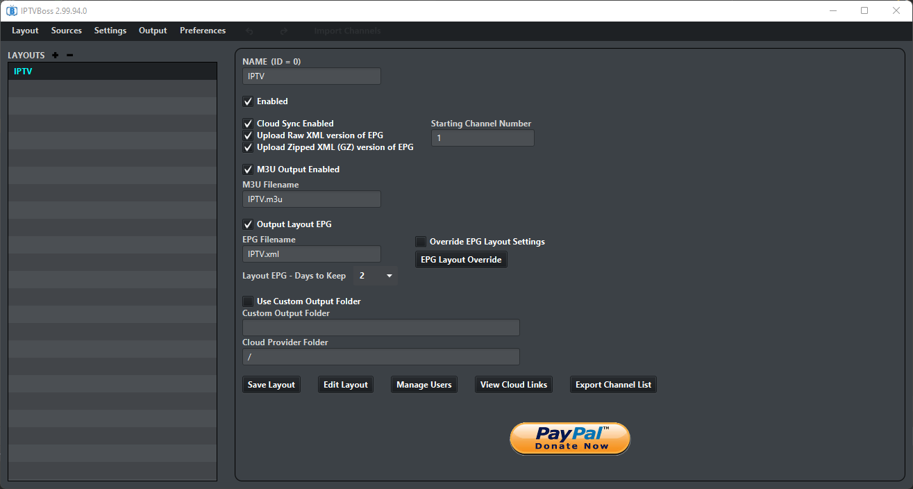
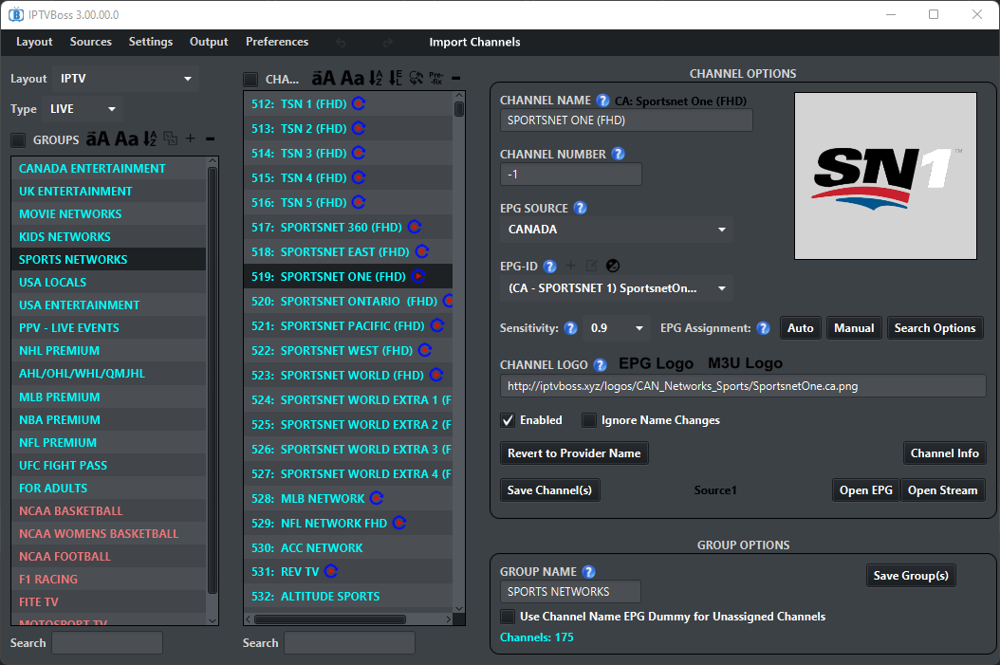
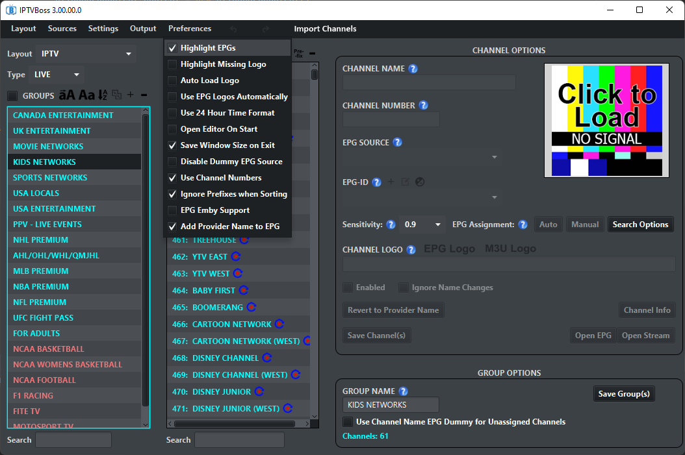
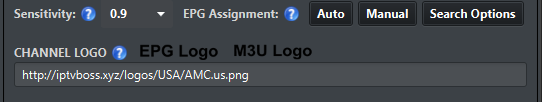
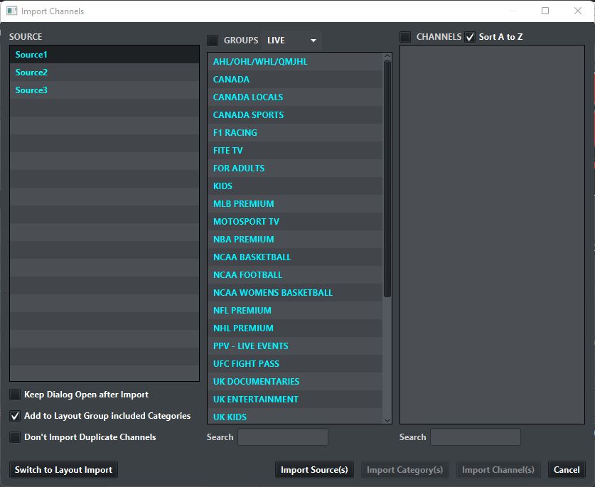
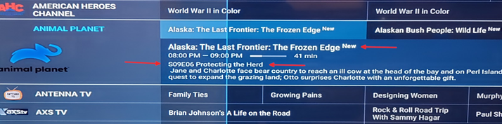
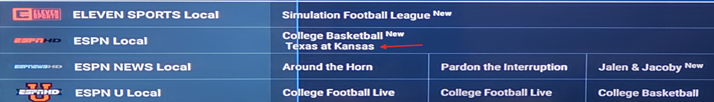

# User Guide

Task-oriented guides for managing your IPTV channels with IPTVBoss/EPGBoss.

**New to IPTVBoss?** Start with the [Quick Start Guide](Quick_Start.md).

---

## Table of Contents

### Getting Started
- [Understanding the IPTVBoss Workflow](#understanding-the-iptvboss-workflow)
- [Setting Up Your First Source](#setting-up-your-first-source)
- [Creating and Managing Layouts](#creating-and-managing-layouts)

### EPG Management
- [Mapping EPG to Channels](#mapping-epg-to-channels)
- [Using Universal EPG](#using-universal-epg)
- [Managing EPG Sources](#managing-epg-sources)

### Output and Distribution
- [Outputting Playlists for Players](#outputting-playlists-for-players)
- [Understanding Cloud Storage Options](#understanding-cloud-storage-options)
- [Using TinyURL for Short Links](#using-tinyurl-for-short-links)

### Automation
- [Setting Up Automatic EPG Syncing](#setting-up-automatic-epg-syncing)
- [Understanding NoGUI Mode](#understanding-nogui-mode)

### Maintenance
- [Backing Up Your Database](#backing-up-your-database)
- [Restoring from Backup](#restoring-from-backup)
- [Handling Provider Changes](#handling-provider-changes)

### Advanced Topics
- [Managing Multiple Users](#managing-multiple-users)
- [Troubleshooting Common Issues](#troubleshooting-common-issues)

---

## Getting Started

### Understanding the IPTVBoss Workflow

IPTVBoss is a **management and organization layer** between your IPTV provider and your player apps. It doesn't stream content - it organizes and enhances playlist files.

**Basic workflow**:
```
Provider → IPTVBoss → Cloud Storage → Player Apps
           ↓
       Organize
       Filter
       Add EPG
```

**Key concept**: IPTVBoss generates static files (M3U playlists and EPG XML files). Your player apps consume these files. When you make changes in Boss, you must output new files and update your player.

**This is NOT real-time**: Think of it like publishing a document. You edit (in Boss), publish (output to cloud), and readers (players) must refresh to see changes.

---

### Setting Up Your First Source

Sources are your IPTV provider connections.

**Prerequisites**:
- IPTV service subscription
- Either M3U URL or XC API credentials from your provider

**Steps**:

1. **Get credentials from your provider**
   - M3U URL method: You'll have a URL, possibly with username/password
   - XC API method: You'll have server URL, username, password

2. **Add source in IPTVBoss**
   - Sources → Sources Manager
   - Choose connection type (M3U URL or XC API)

3. **For M3U URL**:
   - Paste URL
   - Enter username/password if required
   - Click Load
   - Wait for import (may take 1-5 minutes for large playlists)

4. **For XC API** (recommended):
   - Enter server URL (e.g., `http://example.com:8080`)
   - Enter username
   - Enter password
   - Click Load
   - Wait for import

5. **Verify import**:
   - Check channels list
   - Verify categories loaded
   - Note channel count

**XC vs M3U**: XC API is more stable. It handles credential changes better and preserves mappings. Use XC if your provider offers it.

**Troubleshooting**:
- "Could not load categories": Verify credentials, check service is active
- Very slow import: Large playlist (5000+ channels), be patient
- Import fails midway: Check internet connection, try again

---

### Source Manager - Advanced Options

After adding a source, you can configure advanced options in Sources Manager to control how the source behaves.

**Access**: **Sources → Sources Manager**


*Sources Manager panel showing playlist sources and EPG sources management interface*

---

#### Managing Playlist Sources

**Adding Sources**:

There are 3 ways to add playlist sources:

1. **M3U URL** (Basic):
   - Name the playlist (don't use symbols in name)
   - Paste M3U URL or browse for local file
   - **Important**: If playlist uses username/password in video links:
     - Enable "Source Uses Username/Password"
     - Enter username and password
     - Required if planning multiple users or XC conversion later

2. **XC API** (Recommended):
   - Name the playlist
   - Add IPTV service username/password
   - Add IPTV URL up to port (some providers don't have port)
   - Example: `http://myiptvservice.net:1234`

3. **Custom** (Advanced):
   - For non-standard sources
   - Custom configuration required

**After Adding - Load Categories**:
- Click "Load Categories"
- Wait for provider categories to load
- Multi-select categories you want to edit if needed (Ctrl+Click)
- Right-click to change the sync status for selected group(s)

---

#### Playlist Source Options

Once source is added, configure these options:

**Channel Name Modifications**:

1. **Prefix** (Optional):
   - Enter text to add BEFORE all channel names from this source
   - Example: "UK: " → channels become "UK: BBC One", "UK: ITV", etc.
   - Useful for identifying source when mixing multiple providers

2. **Suffix**(Optional):
   - Enter text to add AFTER all channel names from this source
   - Example: " (HD)" → channels become "ESPN (HD)", "CNN (HD)", etc.

**Source Color**(Optional):
- Select color for channels from this source
- Channels display in this color in Layout Editor
- Helps visually identify which source provides which channels

**Content Filtering**:

1. **Ignore VOD** checkbox:
   - When enabled: Source will NOT sync VOD (Video on Demand) channels
   - Reduces clutter if you don't use VOD
   - Speeds up sync

2. **Ignore Series** checkbox:
   - When enabled: Source will NOT sync TV Series channels
   - Useful if you only want live channels
   - Can fix series sync errors from problematic providers
   - Series is not supported when outputing via m3u

**Automatic Sync Behavior**:

1. **Automatically Sync Source on GUI Start**:
   - When enabled: Source syncs automatically when you open IPTVBoss GUI
   - Default: Disabled
   - **Caution**: Can slow down startup if you have many sources

2. **Automatically Enable New Groups Added by Provider**:
   - When enabled: New categories from provider automatically enable
   - New channels in those categories appear in Layout Editor
   - When disabled: Must manually enable new categories
   - **Recommended**: Enable for stable providers, disable for frequently-changing providers

3. **Automatically Clear Channels Removed by Provider after ___ Days**:
   - Enter number of days
   - Channels provider removes are kept for this many days
   - If channel doesn't return within timeframe, Boss removes it from layouts
   - **Purpose**: Handles temporary provider outages vs permanent removals
   - **Example**: Set to 7 days → if provider removes channel but brings it back within a week, your layouts aren't affected
   - **Recommended**: At least 2 days

**Advanced Options**:

1. **Provider Uses Tokens** (M3U option only):
   - Enable if provider uses token system where stream IDs change regularly
   - IPTVBoss uses channel names as "Key" instead of stream ID
   - **Only use if provider specifically uses tokens**
   - Not needed for most providers

2. **Use API for Series**:
   - Makes IPTVBoss use API for series channels
   - **Very slow**
   - Only use if provider doesn't allow "M3U" for series
   - Most providers don't need this

---

#### Managing EPG Sources

EPG sources provide guide data for your channels.

**Adding EPG Sources**:

**Access**: **Sources → Sources Manager** → EPG tab (or Add EPG button)

**Built-in EPG Sources** (IPTVBoss Pro):
1. Click "Add EPG" button
2. Name the EPG Source
3. Click "Source" dropdown
4. Choose EPG from list:
   - US, UK, International Sports, etc.
   - Requires IPTVBoss Pro subscription from [https://members.bosstees.net](https://members.bosstees.net)
5. Click OK

**External EPG Sources**:
1. Click "Add EPG"
2. Name the EPG Source
3. Paste EPG URL (XML format)
4. Click OK


*Add EPG dialog showing EPG source dropdown with built-in guide options*

**EPG Layout Settings**:
- See [Customizing EPG Layout](#customizing-epg-layout-advanced) section
- This is where you configure EPG title/description formatting
- Advanced feature for customizing how EPG appears in players

---

### Creating and Managing Layouts

Layouts are your custom channel organizations. You can have multiple layouts for different purposes or users.

**Video Tutorials**:
- IPTVBoss First Layout Overview: https://youtu.be/gfw0RLfSAnI
- Adding a 2nd Source and Creating a 2nd Layout: https://youtu.be/VNTOei-7KxM

---

#### Layout Manager Panel

The Layout Manager Panel is the main control center for creating and configuring layouts.

**Access**: **Layout → Layout Manager**


*Layout Manager panel showing layout list and configuration options*

**Creating a New Layout**:

1. Click the **"+"** symbol
2. Give your layout a name (e.g., "Family", "Sports", "Kids Safe")
3. Press OK

**Layout Options**:

Once you have a layout created, you can configure the following options:

**Basic Toggles**:

1. **Enabled**:
   - Controls whether this layout gets synced during NoGUI output
   - Disabled layouts are ignored by automation
   - Useful for temporarily disabling layouts without deleting them

2. **Cloud Sync Enabled**:
   - When enabled: Outputted M3U and EPG files upload to your configured cloud provider
   - When disabled: Files only save locally
   - Requires cloud provider setup (see Cloud Storage section)

**EPG/M3U Upload Options**:

3. **Upload Raw XML**:
   - Uploads uncompressed EPG XML file to cloud
   - Larger file size, faster for player to load
   - Some players require raw XML

4. **Upload Zipped XML (GZ)**:
   - Uploads compressed (.gz) EPG file to cloud
   - Much smaller file size, saves bandwidth
   - **Google Drive requires .gz format** (API limitation)
   - Most modern players support .gz

5. **M3U Output Enabled**:
   - When enabled: Outputs M3U playlist file during NoGUI sync
   - When disabled: No M3U generated (EPG only - Not recommended)

6. **M3U Filename**:
   - Custom name for your M3U file
   - **Must end in ".m3u"**
   - Example: `family_playlist.m3u`

7. **Output Layout EPG**:
   - When enabled: Generates layout-specific EPG file during NoGUI sync
   - When disabled: No EPG generated (M3U only - Not recommended unless you have universal EPG enabled or for advanced users)

8. **EPG Filename**:
   - Custom name for your EPG file
   - **Must end in ".xml"** (or ".xml.gz" if using compression)
   - Example: `family_epg.xml`

**EPG Configuration**:

9. **Layout EPG - Days to Keep**:
   - Controls how many days of EPG data to include
   - Lower value = smaller XML file
   - Default is usually sufficient
   - **Use case**: Reduce file size if player has memory limits

10. **Override EPG Layout Settings** (checkbox):
    - When enabled: Use custom EPG layout settings for this layout only
    - When disabled: Use global EPG layout settings
    - See "EPG Layout Customization" section for details

11. **EPG Layout Override** (button):
    - Opens EPG Layout Settings dialog
    - Only active when "Override EPG Layout Settings" is checked
    - Configure title/description format for this layout's EPG
    - See "EPG Layout Customization" section for details

**Output Location**:

12. **Use Custom Output Folder** (checkbox):
    - When enabled: Save M3U/XML files to custom location instead of default
    - When disabled: Files save to default `IPTVBoss/output` folder (Recommended)

13. **Custom Output Folder**:
    - Path where outputted files are saved locally
    - Only used if "Use Custom Output Folder" is enabled
    - Example: `D:\MyPlaylists\`

14. **Cloud Provider Folder**:
    - Subfolder path within your cloud provider
    - Organizes outputted files in cloud storage
    - Example: `Layouts/Family` creates `/{App_Name}/Layouts/Family/` in cloud
    - Leave empty to save in default `/{App_Name}/` cloud folder (Recomended)

**Action Buttons**:

1. **Save Layout**:
   - Saves all layout settings
   - **Important**: Must click after changing any options above

2. **Edit Layout**:
   - Opens Layout Editor for the selected layout
   - Same as **Layout → Layout Editor** menu

3. **Manage Users**:
   - Opens dialog to enable/disable users for this layout
   - User must already exist (see "Managing Multiple Users" section)
   - Controls which users can access this layout

4. **View Cloud Links**:
   - Displays your cloud URLs for M3U and EPG
   - Copy these links to use in your IPTV player app
   - **Note**: Links only appear after first successful upload to cloud

**Tips**:

- **Enable both Raw and GZ**: Some players prefer raw, others need GZ (Google Drive requires GZ)
- **Cloud Provider Folder**: Useful for organizing multiple layouts in cloud storage
- **Custom Output Folder**: Useful if you want local files in specific location for backup/testing
- **Disabled layouts**: Still editable, just not included in automated outputs

---

**Creating a layout**:

1. **Start new layout**
   - Layout → Layout Manager (then click "+" to create new)
   - Name it descriptively (e.g., "Family", "Sports", "John's Playlist")

2. **Add channels from source**
   - Select your layout
   - Click "Add Channels"
   - Browse your source's categories
   - Select groups or individual channels
   - Click "Add to Layout"

3. **Assing EPG**
   - Select a channel or channels
   - Select only the EPG region for the channel yo uare mapping in Search Options
   - Click Auto

4. **Organize channels**
   - Drag channels between groups
   - Rename groups for clarity
   - Delete unwanted channels (click channel, click minus/delete button)
   - Delete unwanted groups
   - Reorder channels within groups

**Layout strategies**:

**Single comprehensive layout**:
- All channels organized by type (Sports, Movies, News, etc.)
- Good for personal use
- Easier to maintain

**Multiple specialized layouts**:
- "Kids Safe" - only kid-appropriate channels
- "Sports Only" - sports channels
- "International" - specific language channels
- Good for family or multiple users with different needs

**Tips**:
- Start small - add favorites first, expand later
- Delete what you won't watch - clutter makes navigation hard
- Use consistent naming - "Sports: NFL" better than random names
- For advanced users, consider custom groups & group logically - by topic, not by provider's categories

---

### Working in Layout Editor

The Layout Editor is where you organize, edit, and manage channels within a layout.

**Access**: **Layout → Layout Editor**

**Layout Editor Interface**:

**Left Side**:
- **Groups List** (top) - Your Layout Groups
- **Channels List** (bottom) - Channels in selected group

**Right Side**:
- **Channel Options** (top) - Edit selected channel properties
- **Group Options** (bottom) - Edit selected group properties

---

#### Channel Options (Right Panel)

When you select one or more channels, the Channel Options panel lets you edit channel properties.

**Channel Name**:
- Editable text box
- Your custom name for the channel
- Provider's original name shown above the box (greyed out)
- Can be different from provider name

**Channel Number**:
- Default: -1 (automatic numbering)
- **Recommended**: Leave at -1
- If you manually assign numbers, **read the tooltip** (hover over field)
- Manual numbering can cause gaps/conflicts

**EPG Source**:
- Dropdown: Which EPG source to use for this channel
- Choose from your enabled EPG sources (US, UK, Sports, etc.)

**EPG-ID**:
- Dropdown: Specific EPG channel ID from the selected source
- Must match a channel in the EPG source
- This is what links your channel to guide data

**EPG Assignment Buttons**:

1. **Search Options**:
   - Opens dialog to select which EPG sources to search
   - **Best Practice**: Only select the region you need
   - Example: Mapping USA channel? Only enable USA EPG source
   - Improves accuracy by avoiding conflicts from similar international channels

2. **Auto Assign** (Pro only):
   - Automatically matches channel to EPG based on channel name
   - Uses enabled sources from Search Options
   - Uses Sensitivity setting (see below)
   - Quick but may need manual verification

3. **Manual Assign**:
   - Opens dialog showing best EPG matches
   - Cycles through highlighted channels one by one
   - You select correct EPG from list
   - More accurate than Auto

4. **Sensitivity** dropdown:
   - Controls how strict Auto matching is
   - Default: 0.9
   - Higher = more strict (fewer errors, fewer matches)
   - Lower = less strict (more matches, more errors)
   - **Recommendation**: Leave at 0.9 unless you understand the implications

**Channel Logo**:
- URL text box showing current logo link
- Image preview (if auto-load logos enabled)
- Click image to view logo

**Logo Buttons**:
1. **EPG Logo**: Import logo from selected EPG source (if available)
2. **M3U Logo**: Import logo from provider's M3U/API source

**Logo Options** (if available):
- Auto-assign logo when source changes
- Can set to use EPG or M3U as default

**Channel Toggle Options**:

1. **Channel Enabled** checkbox:
   - Enabled: Channel appears in output
   - Disabled: Channel hidden from output (but kept in layout)

2. **Ignore Name Changes** checkbox:
   - When enabled: Channel keeps your custom name even if provider renames
   - When disabled: Provider name changes will update your channel name

**Action Buttons**:

1. **Revert to Provider Name**:
   - Resets channel name to provider's original name
   - Undoes your custom naming

2. **Channel Info**:
   - Opens dialog showing:
     - Stream URL
     - Channel ID
     - Source information
     - Other technical details

3. **Open EPG**:
   - Opens EPG Browser focused on this channel
   - Shows guide data for verification

4. **Open Stream** (requires VLC):
   - Opens channel stream in VLC player for testing
   - **Requirements**:
     - VLC64 must be installed
     - VLC architecture (x86/x64) must match Java architecture
   - Use to test if stream works before outputting

5. **Save Channel(s)**:
   - Saves changes made to channel properties
   - **Important**: Required after changing name, number, logo URL, EPG
   - Checkboxes (enabled, ignore name changes) auto-save

**Bulk Editing Channels**:

1. **Select multiple channels**:
   - Use Shift+Click (range) or Ctrl+Click (individual)
   - Or use "Select All" checkbox

2. **Channel Options become greyed out**

3. **To edit bulk-selected channels**:
   - **Click on the label itself** (e.g., click the text "Channel Logo")
   - Field unlocks for bulk editing
   - Make changes
   - Click Save Channel(s)

4. **Bulk edit use cases**:
   - Assign same EPG source to many channels
   - Bulk enable/disable channels
   - Apply logo from EPG to multiple channels at once

---

#### Group Options (Right Panel, Bottom)

When you select a group, the Group Options panel lets you configure group settings.

**Group Name**:
- Editable text box
- Your custom name for this group
- Appears in player apps

**Use Channel Name EPG Dummy for Unassigned Channels**:
- When enabled: Channels without EPG get a "Channel Name EPG Dummy"
- This creates placeholder EPG using channel name
- Useful for channels that don't have real EPG available
- **Note**: This is for regular EPG sources, not AED (Advanced EPG Dummies)
- For AED/sports events, see Advanced EPG Dummies feature

**Save Group(s)**:
- Saves changes to group settings
- Click after changing group name or options

---

#### Groups List Controls (Left Side, Top)

Buttons above Groups List (left to right):

1. **Convert to Uppercase**: Changes selected group names to UPPERCASE
2. **Convert to Sentence Case**: Changes selected group names to Sentence case
3. **Sort A to Z**: Sorts groups alphabetically
4. **Merge**: Merges selected groups into one
5. **Add Group**: Creates new empty group
6. **Remove Group**: Deletes selected group (and channels)

**Group List Actions**:
- **Right-click**: Enable/disable group (disabled groups show red, won't output)
- **Shift + Right-click**: Completely remove group from layout
- **Drag groups**: Reorder groups (changes order in player apps)

---

#### Channels List Controls (Left Side, Bottom)

Buttons above Channels List (left to right):

1. **Convert to Uppercase**: Changes selected channel names to UPPERCASE
2. **Convert to Sentence Case**: Changes selected channel names to Sentence case
3. **Sort A to Z**: Sorts channels alphabetically
4. **Sort by Missing EPG/Logos**: Sorts channels with missing EPG/logos to top
5. **Find and Replace**: Opens find/replace dialog for channel names
6. **Add Prefix/Suffix**: Adds text before/after channel names
7. **Remove Channel**: Deletes selected channel(s)

**Channel List Actions**:
- **Right-click**: Enable/disable channel (disabled channels show red)
- **Shift + Right-click**: Completely remove channel from layout
- **Drag channels**: Move between groups or reorder within group
- **Multi-select**: Use Shift (range) or Ctrl (individual) or "Select All" checkbox

---

#### Layout Editor Features

**Undo/Redo**:
- Most actions in Layout Editor can be undone
- Use Undo and Redo buttons in top toolbar
- Very helpful when accidentally deleting/moving channels

**Highlight Missing EPGs** (Preferences):
- Enable in Preferences to colorize channels based on EPG status
- Shows which channels still need EPG mapping
- **Important**: Color indicates EPG is assigned, NOT that it's correct
- You still need to verify EPG mappings are accurate

**Find and Replace** (Magnifying glass icon):
- Above Channels list
- Opens dialog for batch find/replace operations
- **Note**: Only affects channels, not groups
- Use for removing prefixes, fixing naming patterns, etc.

**Prefix Auto-Removal**:
- **Sources → Prefix Auto-Removal**
- Automatically removes common prefixes from channel names
- Alternative to manual find/replace


*Layout Editor panel showing groups list, channels list, channel options, and group options interface*


*Channel list showing highlighted channels with missing EPG mappings ready for auto-mapping*


*Search Options dialog showing checkboxes for different EPG guides to enable/disable for mapping*


*Channel Editor showing EPG Assignment section with Auto and Manual buttons and EPG sensitivity settings*

---

### Importing Channels into Layouts

Once you have sources configured, you need to import channels from those sources into your layouts. IPTVBoss provides two dialogs for this purpose.

**Access**: In Layout Editor, click the **Import Channels** button (often labeled "Add Channels")

---

#### Import Channels From Sources Dialog

**What it does**: Imports channels from your IPTV provider sources into the current layout.


*Import Channels From Sources dialog showing source selection, categories list, and channels list with import options*

**Import Methods**:

1. **By Source**: Import all enabled groups from selected source(s)
   - Select one or more sources
   - Click "Import by Source"
   - All enabled categories from those sources get imported

2. **By Category**: Import specific categories
   - Select one or more categories (multi-select with Shift/Ctrl)
   - Click "Import by Category"
   - Only selected categories get imported

3. **By Channel**: Import individual channels
   - Select category to see its channels
   - Multi-select specific channels
   - Click "Import by Channel"

**Multi-Select**:
- **Shift+Click**: Select range
- **Ctrl+Click**: Select individual items

**Search Boxes**:
- Bottom of Groups panel and Channels panel
- Filter lists by typing search term
- Makes finding specific groups/channels faster

**Import Behavior**:
- Channels can be imported multiple times (no duplicate prevention by default)
- If a Layout Group name matches a Provider Category name, channels go into that existing Layout Group
- Otherwise, a new Layout Group is created matching the Category name

**Options**:

1. **Keep Dialog Open After Import**:
   - When enabled: Dialog stays open after clicking import
   - **Use case**: Manually adding multiple individual groups or channels one at a time
   - When disabled: Dialog closes after import

2. **Add to Layout Group included Categories**:
   - **Enabled by default**
   - Links this Provider Category to this Layout Group
   - **Result**: Future channels added by provider to this category automatically import to this Layout Group
   - This is how automatic channel updates work (see New Channel Manager)

3. **Don't Import Duplicate Channels**:
   - When enabled: Won't import a channel that already exists in the target Layout Group
   - Prevents duplicate entries
   - Useful when re-importing or updating from source

---

#### Import Channels From Layouts Dialog

**What it does**: Copies channels from one layout to another layout.


*Import Channels From Layouts dialog showing layout selection, groups list, and channels list with import options*

**Use Cases**:
- Creating a second layout for different users (e.g., Kids layout from Main layout)
- Sharing channels between layouts
- Creating specialized layouts from master layout

**Import Methods**:

1. **By Layout**: Import all enabled groups from selected layout(s)
   - Select one or more layouts
   - Click "Import by Layout"
   - All enabled groups from those layouts get imported

2. **By Group**: Import specific groups
   - Select one or more groups (multi-select with Shift/Ctrl)
   - Click "Import by Group"
   - Only selected groups get imported

3. **By Channel**: Import individual channels
   - Select group to see its channels
   - Multi-select specific channels
   - Click "Import by Channel"

**Search Boxes**:
- Bottom of Groups panel and Channels panel
- Filter lists by typing
- Helps find specific groups/channels across layouts

**Import Behavior**:
- Channels can be imported multiple times
- If a Layout Group name matches an existing group, channels go into that existing group
- Otherwise, a new Layout Group is created

**Options**:

1. **Keep Dialog Open After Import**:
   - Same as Sources dialog
   - Keeps dialog open for multiple imports

2. **Import as Linked Layout Group**:
   - **Important advanced option**
   - Creates a **carbon copy** of the selected group
   - **Group is NOT editable** in the new layout
   - Any changes made to the group in the **original layout** automatically appear in the new layout
   - **Use cases**:
     - Master layout with shared content across multiple user layouts
     - Maintaining consistent groups across layouts
     - Centralized control of specific groups

3. **Don't Import Duplicate Channels**:
   - Prevents importing channels that already exist in target Layout Group

**Tips**:

- **First-time setup**: Import by Category/Group for bulk setup
- **Fine-tuning**: Import by Channel for specific additions
- **Multi-layout management**: Use "Linked Layout Groups" for content you want synced across layouts
- **Search feature**: Essential when dealing with large channel lists

---

## EPG Management

### Mapping EPG to Channels

EPG (Electronic Program Guide) shows what's playing now and upcoming programs. IPTVBoss matches your channels to EPG sources.

**Why mapping is needed**: Your provider's channel names rarely match EPG source channel names exactly. Boss tries auto-matching but sometimes needs manual help.

**Prerequisites**:
- Boss Pro license (EPG features require Pro)
- EPG sources loaded (Boss Pro includes many built-in)

**Auto-mapping** (easiest):

1. **Load EPG sources**
   - Sources → Sources Manager
   - Add EPG sources you need (US, UK, Sports, etc.)
   - Boss Pro includes extensive EPG library

2. **Auto-map channels**
   - Select layout
   - Select group or all channels
   - Right-click → Auto Map EPG
   - Boss attempts intelligent matching
   - Review results - may not be 100% accurate

3. **Verify and fix**
   - Check channels with "Open EPG"
   - If EPG is wrong or missing, manually map

**Manual mapping** (for accuracy):

1. **Select channel**
   - In layout view, click channel needing EPG

2. **Open EPG mapping**
   - Channel options → EPG Mapping
   - or right-click → Map EPG

3. **Search for EPG channel**
   - Type channel name (e.g., "ESPN")
   - Browse results
   - Match your channel to correct EPG entry

4. **Assign**
   - Select correct EPG channel
   - Click Assign/OK
   - Save changes

5. **Verify**
   - Right-click channel → Open EPG
   - Check guide data appears
   - Verify it's correct program info

**Best practices**:
- Map major channels manually for accuracy
- Use auto-map for bulk of channels, then manually fix important ones
- Check EPG after mapping before outputting
- Sport channels need sports EPG sources
- Movie channels need movie EPG sources

**Common issues**:
- EPG shows briefly then disappears: Check "Days to Keep" settings (see Troubleshooting)
- Wrong program info: Mapped to wrong EPG channel, remap
- No EPG at all: Source not enabled, or channel has no EPG in sources

---

### Using Universal EPG

Universal EPG generates ONE EPG file for all your layouts. Much more efficient than individual EPGs per layout.

**Benefits**:
- Saves cloud storage bandwidth (massive)
- One EPG to update instead of many
- Simpler management
- Recommended for multiple layouts

**Setup**:

1. **Enable Universal EPG**
   - Sources → Universal EPG Options
   - Enable it
   - Configure retention (7-14 days recommended)

2. **Map channels** (same as normal EPG mapping)
   - Mappings automatically go into Universal EPG
   - All layouts share the same EPG mappings

3. **Output**
   - When outputting layouts, Boss uses Universal EPG automatically
   - One EPG file serves all layouts

**vs Individual EPG**:
- Individual: Each layout has separate EPG file, separate mappings
- Universal: One EPG file, shared mappings across layouts

**When to use Individual EPG**:
- Different EPG sources for different layouts (rare need)
- Each layout needs completely different EPG retention settings

**When to use Universal** (recommended):
- Multiple layouts
- Want to minimize bandwidth
- Easier management

---

### Managing EPG Sources

Boss Pro includes many built-in EPG sources. You enable what you need.

**Available sources**:
- US: US channels (networks, cable, etc.)
- UK: UK channels (networks, cable, etc.)
- International Sports: Comprehensive sports EPG
- Many others (By region)

**Enabling sources**:

1. **Access EPG sources**
   - Sources → Sources Manager
   - Click "Add EPG" to add EPG sources

2. **Enable needed sources**
   - Add only sources you need
   - Don't enable everything - only what you actually use
   - More sources = slower sync, more bandwidth

3. **Sync EPG**
   - Sources → Sync All EPGs
   - Downloads current EPG data
   - Takes 1-15 minutes depending on sources enabled

4. **Set sync schedule**
   - Configure via automation (Task Scheduler/cron)
   - Automatic daily syncs recommended
   - 1-2x daily is typical

**External EPG sources**:
- You can add external EPG XML files if needed
- Sources → Sources Manager → Add EPG
- Provide URL to EPG XML file
- Less common - built-in sources usually sufficient

---

### Customizing EPG Layout (Advanced)

IPTVBoss allows you to customize how EPG information appears in your player apps. This powerful feature lets you control what information shows in program titles and descriptions.

**Compatible Players**:
- TiviMate (enable "Two-line program titles")
- Implayer (enable "Two-line program titles")
- Other players may support custom EPG formatting

**What you can customize**:
- EPG Title format
- EPG Description format
- Add/remove components like:
  - NEW tag (for new episodes)
  - LIVE tag (for live events)
  - Episode information
  - Season/Episode numbers
  - Ratings
  - Year
  - Categories
  - And more

**Access EPG Layout Settings**:

1. **For specific EPG source**:
   - Go to **Sources → Sources Manager**
   - Select an EPG source
   - Click **"EPG Layout Settings"** button
   - EPG Layout Settings dialog opens

2. **For layout override**:
   - Some layouts can override EPG layout settings
   - Layout Manager → Select layout → "EPG Layout Override" button
   - (If "Override EPG Layout Settings" is enabled for that layout)

**Customizing the Layout**:

1. **Title and Description Windows**:
   - You'll see two panels: **Title** and **Description**
   - These control what appears in your player's EPG

2. **Available Components** (bottom of dialog):
   - Drag components from the bottom into Title or Description windows
   - Common components:
     - `{NEW}` - Shows "NEW" tag for new episodes
     - `{LIVE}` - Shows "LIVE" tag for live broadcasts
     - `{EPISODE_TITLE}` - Episode name
     - `{SEASON}` - Season number
     - `{EPISODE}` - Episode number
     - `{RATING}` - Content rating
     - `{YEAR}` - Release year
     - `{CATEGORIES}` - Program categories

3. **Arrangement**:
   - Drag components to arrange order
   - Remove components you don't want
   - Add text/separators between components

**Important Notes**:
- Your EPG source must include these components for them to appear
- Not all EPG sources have all fields available
- Players are limited in how much they can display (keep it reasonable)
- Premium EPG sources (Schedules Direct, TV Guide, Zap2it) have the most components

**Copy Layout From Another Source**:

If you created an EPG layout you like and want to use it for other sources:

1. Add the new EPG source
2. Open its EPG Layout Settings
3. Click **"Copy Layout From"** button
4. Select the source whose layout you want to copy
5. Click Copy
6. The layout is duplicated to the new source

**Example Use Case**:

DVR Recording Setup:
- Some DVR software (Emby, Plex) only records episodes marked "NEW", not "LIVE"
- Solution: Add `{NEW}` tag to sports event titles
- Settings → Manage Live Tags → Change "Live Tag Format" to "New"
- Sports events now appear as "NEW" and DVR will record them


*EPG Layout Settings dialog showing custom title and description configuration with draggable components*


*Example result of custom EPG layout showing formatted program title and description in player*


*Example result of custom EPG layout showing formatted program information*


*Example result of custom EPG layout showing formatted program details*

**Troubleshooting**:
- **Components not appearing**: EPG source doesn't include that data
- **Player not showing custom format**: Enable "Two-line program titles" in player settings
- **Too much information**: Player apps have display limits, simplify your layout

---

### EPG Browser

The EPG Browser is a viewing tool that lets you see the guide data for your channels, helping you verify that EPG mappings are correct.

**What it is**:
- Visual EPG viewer built into IPTVBoss
- Shows program guide data for channels
- Verifies EPG mapping accuracy
- Previews what will appear in your player apps

**Access Methods**:

1. **From main menu**:
   - **Layout → EPG Browser**
   - Opens browser showing all channels in current layout
   - Navigate between channels

2. **From Layout Editor** (specific channel):
   - Select a channel in Layout Editor
   - In Channel Options panel, click **"Open EPG"** button
   - Opens EPG Browser focused on that specific channel
   - Quickest way to verify individual channel mapping

**What it shows**:
- Program schedule for the selected channel
- Program titles
- Dates and times
- Descriptions (if available)
- EPG coverage range (how many days of guide data)

**Why use it**:

1. **Verify EPG mapping**: After assigning EPG to a channel, use EPG Browser to confirm:
   - Correct channel mapped (shows proper programs)
   - EPG data is current
   - No gaps in guide data

2. **Troubleshoot EPG issues**:
   - Channel shows "No EPG": Either no EPG assigned, or EPG source doesn't have data for this channel
   - Wrong programs showing: Mapped to wrong EPG channel, needs remapping
   - Old data: EPG needs syncing (Sources → Sync All EPGs)

3. **Preview before output**:
   - See what guide data will appear in player
   - Verify EPG customization (if using custom EPG layouts)

**Workflow Example**:

1. Map EPG to channel using Auto or Manual assign
2. Click "Open EPG" button in Channel Options
3. EPG Browser opens showing guide data
4. Verify program titles match what should be on this channel
5. If correct: Move to next channel
6. If incorrect: Close browser, remap channel to different EPG

**Tips**:

- **Color indicators**: In Layout Editor, "Highlight Missing EPGs" preference colorizes channels by EPG status
  - **Important**: Color indicates EPG is assigned, NOT that it's correct
  - Always verify important channels with EPG Browser
- **No data showing**: EPG source might not include this channel, try different EPG source
- **Gaps in schedule**: Normal for some channels, EPG sources vary in completeness

---

## Output and Distribution

### Outputting Playlists for Players

Outputting generates M3U and EPG files for your player apps.

**When to output**:
- After creating/editing layouts
- After mapping EPG
- After any changes you want players to see
- After source syncs (if channel names changed)

**Output process**:

1. **Select what to output**
   - Output Current Layout (just one layout)
   - Output All Layouts (all at once)
   - Output all alyouts & EPGs (Everything!)

2. **Wait for completion**
   - Progress indicator shows status
   - Files generate locally
   - Files upload to cloud storage
   - May take 1-5 minutes for large playlists

3. **Verify completion**
   - Check for success message
   - View Cloud Links to see URLs

4. **Get URLs**
   - Click "View Cloud Links"
   - Copy M3U URL
   - Copy EPG URL
   - Or copy TinyURL short versions

**What gets generated**:
- `.m3u` file: Playlist with channel URLs
- `.xml` or `.gz` file: EPG data
- Both uploaded to your cloud storage
- TinyURL short links created (if configured)

**Using in players**:

**First time setup**:
1. Player app → Add Playlist
2. Enter M3U URL
3. Enter EPG URL
4. Save/Add
5. Wait for import

**Updating after changes**:
1. Output from Boss (generates new files)
2. Player app → Update Playlist
3. Wait for refresh

**Don't** delete and re-add playlist for updates - just update/refresh.

---

### Understanding Cloud Storage Options

IPTVBoss uploads M3U and EPG files to cloud storage for access from player apps.

**Supported providers**:
- Dropbox (Recommended)
- Google Drive

**Choosing**:
- Dropbox: Simple, widely supported
- Google Drive: Often more generous bandwidth
- Either works fine

**Bandwidth considerations**:

**Free Dropbox**:
- ~20GB/month bandwidth
- Fine for personal use (1-5 devices)
- 40-50 users often exceeds limit

**Free Google Drive**:
- Often more generous
- Check current limits

**Paid tiers**:
- Consider if supporting many users
- Or use bandwidth optimization (Universal EPG, exclude VOD, .gz format)

*Watch cloud setup video of your choice and follow cloud storage setup instructions before continuing*
- Dropbox (recommended): https://youtu.be/2cfEEqFYHrc
- Google Drive: https://youtu.be/A45N6Vgk-OU
   - You must use the gz EPG link with Google Drive - Not XML

**Setup** (quick reminder):
1. Settings → IPTVBoss Settings
2. Choose Dropbox or Google Drive
3. Authorize (OAuth in browser)
4. Verify authorization success

**Reauthorization**:
- OAuth tokens expire periodically
- After OS reinstalls/upgrades
- If uploads fail, try reauthorizing

---

### Using TinyURL for Short Links

TinyURL converts long cloud storage URLs into short, manageable links.

**Why use it**:
- Cloud URLs are extremely long (100+ characters)
- Hard to type or share
- TinyURL creates short URLs (20-30 characters)

**Setup**:

1. **Create TinyURL account** (tinyurl.com)
2. **Generate API key** (in TinyURL account settings)
3. **Configure in Boss** (Settings → TinyURL)
4. **Enter API key**, save

**Usage**:
- After output, TinyURL links automatically generated
- View Cloud Links shows both full URLs and TinyURL versions
- Use TinyURL versions in players for convenience

**Troubleshooting**:
- "Unauthenticated": API key not entered or wrong
- "503": TinyURL service down (temporary)
- Links not generating: Delete cloud files, re-output

**Alternative**: You can skip TinyURL and use direct cloud URLs. They work fine, just longer.

---

## Automation

### Setting Up Automatic EPG Syncing

EPG data updates periodically. Automate syncing so guide stays current.

**Why automate**:
- Manual syncing is tedious
- EPG goes stale without updates
- Set it once, forget it

**Video Tutorial**: https://youtu.be/2nIsgC3wv_E

---

**Setup Steps**:

1. **Open IPTVBoss with proper permissions**:
   - **Windows**: Right-click IPTVBoss → "Run as administrator" (REQUIRED)
   - **Mac/Linux**: Open normally (permissions handled during setup)

2. **Configure sync schedule in Boss**:
   - Go to **Settings → Sync Schedule**
   - Select sync times (e.g., 6 AM and 6 PM)
   - Choose which days (typically all days)
   - Enable the schedule
   - Click OK

3. **What Boss does automatically**:
   - **Windows**: Boss creates Windows Task Scheduler tasks for you
   - **Mac**: Boss creates cron jobs for you
   - **Linux**: Boss creates cron jobs for you
   - ✅ You do NOT manually create tasks/cron entries - Boss handles it

4. **Verify automation created**:
   - **Windows**: Open Task Scheduler → Look for IPTVBoss sync tasks
   - **Mac/Linux**: Run `crontab -l` in terminal to see Boss-created cron jobs

5. **Test it**:
   - Wait for scheduled time, OR
   - Manually test: **Sources → Sync All EPGs** (doesn't affect schedule)
   - Check **Logs → View Logs** for sync activity
   - Verify EPG updated

---

**Important Platform-Specific Notes**:

**Windows**:
- ⚠️ **MUST run Boss as administrator** to access Sync Schedule menu
- Boss creates Task Scheduler tasks with correct permissions automatically
- Tasks run even when Boss isn't open
- If sync fails, check task runs with "highest privileges" in Task Scheduler

**Mac**:
- Boss creates cron jobs automatically
- **May require**: System Preferences → Security & Privacy → Full Disk Access → Add IPTVBoss
- Alternative: Use launchd instead of cron (more reliable on Mac)
- Check permissions if syncs don't run

**Linux**:
- Boss creates cron jobs automatically
- User must have permissions to IPTVBoss folder
- Cron uses absolute paths (Boss handles this automatically)
- Check `crontab -l` if syncs don't run

---

**Recommended Sync Frequency**:
- **1-2 times daily** is typical
- EPG providers update 1-2x daily usually
- More frequent syncing doesn't improve data, just wastes resources
- **Don't sync more than 4 times daily**

**Best Sync Times**:
- **Early morning (6-8 AM)**: Fresh data for the day
- **Evening (6-8 PM)**: Updated evening/night data
- Avoid peak usage times

**Manual Sync Anytime**:
- You can always manually sync: **Sources → Sync All EPGs**
- Manual syncs don't affect automatic schedule

---

### Understanding NoGUI Mode

NoGUI is IPTVBoss running in command-line mode without the graphical interface.

**What NoGUI is**:
- Command-line mode that runs Boss without GUI
- Used by automatic sync schedule (created via Settings → Sync Schedule)
- Boss launches NoGUI automatically when scheduled tasks/cron jobs run

**What NoGUI does when it runs**:
- Syncs all enabled EPG sources (**Sources → Sync All EPGs**)
- Syncs all enabled playlist sources (**Sources → Sync All Sources**)
- Outputs all enabled layouts (**Output → All Layouts & EPG**)
- Exits when done

**You DON'T need to manually set up NoGUI** - it's handled automatically when you use **Settings → Sync Schedule**.

**Manual NoGUI run** (for testing only):
```bash
iptvboss -nogui
```
This runs Boss in command-line mode to test that sync works. Watch output to see what happens.

**Troubleshooting NoGUI**:
- **Completes in 5 seconds**: Not finding configurationbase - check paths
- **No output generated**: Check permissions, paths, or that layouts are enabled
- **Errors**: Check **Logs → View Logs** for error messages

**Platform-Specific Notes**:

**Windows**:
- NoGUI tasks created by Boss run via Windows Task Scheduler
- Tasks automatically run with "highest privileges" (if Boss was opened as admin)
- If sync fails, check Task Scheduler to ensure task exists and runs correctly

**Mac**:
- NoGUI jobs created by Boss use cron or launchd
- **May require**: System Preferences → Security & Privacy → Full Disk Access → Add IPTVBoss
- Launchd is more reliable than cron on macOS
- Check permissions if syncs don't run

**Linux**:
- NoGUI jobs created by Boss use cron
- User must have read/write permissions to IPTVBoss folder
- Boss automatically uses absolute paths in cron entries
- Run `crontab -l` to verify Boss-created entries exist

---

## Managing Automatic Channel Imports

### New Channel Manager

The New Channel Manager controls how new channels added by your provider are automatically imported into your layouts.

**What it does**:
- When providers add new channels to enabled categories
- IPTVBoss can automatically add them to your Layout Groups
- Saves manual work of constantly checking for new channels
- Ensures you don't miss new content from your provider

**Access New Channel Manager**:
- **Layout → New Channel Manager**
- Or from Layout Editor toolbar (may appear as button)

**How it works**:

When you import channels directly from a source, IPTVBoss automatically creates links between:
- **Provider Categories** (source groups)
- **Layout Groups** (your custom groups)

When the provider adds channels to those categories, they automatically appear in your linked Layout Groups.

**Managing Category Links**:

1. **Select Layout Group** (left side)
   - Choose which Layout Group you want to configure

2. **View Included Categories** (right side)
   - Shows which provider categories feed into this group
   - These are the "Included Categories"

3. **Add Category Links**:
   - Drag provider categories from Categories list into "Included Categories"
   - New channels from those categories will auto-import to this Layout Group

4. **Remove Category Links**:
   - Drag category out of "Included Categories"
   - Or right-click and remove
   - Stops automatic imports from that category

**Use Cases**:

**Scenario 1: Keep Sports Group Updated**
- You have a "Sports" Layout Group
- Link it to provider categories: "Sports", "ESPN Channels", "NFL Network"
- When provider adds new sports channels, they automatically appear in your Sports group

**Scenario 2: Kids Safe Playlist**
- Create "Kids" Layout Group
- Link only to "Kids", "Cartoons", "Family" provider categories
- New family-friendly channels auto-import
- Adult categories are NOT linked, so stay out

**Scenario 3: International Channels**
- "Spanish Channels" Layout Group
- Link to "Spanish", "Latin America", "Spain" provider categories
- New Spanish channels auto-add

**Best Practices**:

1. **Review New Channels Periodically**:
   - Auto-import adds channels, but doesn't map EPG
   - Check new channels and map EPG as needed

2. **Use Selective Linking**:
   - Don't link every category to every group
   - Be intentional about which categories feed which groups

3. **Combine with Source Settings**:
   - In Source Manager, you can enable "Automatically Enable New Groups Added by Provider"
   - This works with New Channel Manager for complete automation

4. **Test Before Outputting**:
   - After provider adds channels, open Layout Editor
   - Verify new channels appear where expected
   - Map EPG, adjust channel order, etc.
   - Then output to players

**Troubleshooting**:

**New channels not appearing**:
- Check category is in "Included Categories" for the Layout Group
- Verify category is enabled in Source Manager
- Check source sync completed successfully

**Wrong channels appearing**:
- Provider may have reorganized categories
- Review Included Categories links
- Remove unwanted category links

**Too many channels auto-importing**:
- Be more selective with category links
- Use "Don't Import Duplicate Channels" in import settings
- Consider manual channel management for complex setups


*New Channel Manager dialog showing Layout Groups on left and Included Categories with drag-and-drop interface*

---

## Maintenance

### Backing Up Your Database

Database contains all your layouts, mappings, and settings. Back it up regularly.

**Automatic backups**:
- Boss creates automatic backups periodically
- Stored in IPTVBoss/backup folder
- Dated files (e.g., `backup_2024-11-01.backup`)
- Keeps several recent backups

**Periodic External backup**:
1. Copy entire `IPTVBoss/backup` folder to USB drive or similar
2. Do this as needed or before major changes
3. Protects against complete system failure

---

### Restoring from Backup

When things go wrong, restore from backup.

**When to restore**:
- Database corruption
- All layouts disappeared
- Accidental deletion
- After bad source sync
- Lost Pro license
- Moving to new computer

**Restore process**:

1. **Open IPTVBoss** (if possible)
   - May show empty if database is corrupted
   - That's okay

2. **Access restore**
   - Settings → Restore Database
   - Choose Local, Cloud or URL

3. **Select backup**
   - Browse backup files
   - URL must point to a direct download file

4. **Wait for restore**
   - Takes 1-5 minutes
   - Don't interrupt

5. **Verify**
   - Check layouts are back
   - Verify EPG mappings
   - Re-enter Pro license if needed

**If restore fails**:
- Try older backup
- Recent one might be corrupted too
- Try cloud or URL restore if local fails (or vice versa)

**After restore**:
- Re-enter Pro license if prompted
- Verify cloud storage authorization
- Test output to ensure everything works

---

### Handling Provider Changes

Providers sometimes change channel names, URLs, or structure. This can break your layouts.

**Prevention**:

1. **Check provider announcements**
   - Before syncing, see if provider posted changes

2. **Use XC API instead of M3U**
   - XC handles changes better
   - More stable than M3U URLs
   - Ask provider if they offer XC

**When sync breaks layouts**:

**Symptoms**:
- Channels disappear after sync
- EPG mappings lost
- Groups empty

**Recovery**:
1. Settings → Restore Database
2. Select backup from immediately before sync
3. Your layouts return to pre-sync state

**Going forward**:
- Don't sync that source again until provider stabilizes
- Or remap everything manually (time-consuming)
- Or switch to XC API if available

**Credential changes**:
- New username/password from provider
- With M3U: Creates new source identity, loses all mappings
- With XC: Often preserves mappings
- Backup before changing credentials

---

## Advanced Topics

### Managing Multiple Users

User System allows managing multiple users with identical or customized layouts.

**Use cases**:
- Family members with same channels
- Friends on same provider
- Multiple devices with same setup

**Basic approach**:
- Create separate layouts for each user
- Output each layout separately
- Each user gets unique M3U/EPG URLs
- Hard to manage - linked groups can help

**User System approach**:
- Define one "master" layout
- User System replicates to multiple users
- Changes to master propagate to all users
- Or allow per-user customization

**Setup** (basic):

1. **Create layouts for each user**
   - "User1_Channels"
   - "User2_Channels"
   - etc.

2. **Customize per user**
   - Different channel selections
   - Different organizations

3. **Output separately**
   - Output each layout
   - Each generates unique URLs

4. **Distribute URLs**
   - Give each user their specific M3U/EPG URLs
   - Users can't see other users' customizations

**User System**:
1. **Create master layout**
   - "Master Playlist"

2. **Manager Uers / Add user**
   - Input user/pass for each user for source
   - Enable User, Source & Layout
   - Repeat as needed

3. **Output**
   - Unique outputs for all users (with thier user/pass), same content

4. **Distribute URLs**
   - Give each user their specific M3U/EPG URLs
   - Users can't see other users' credentials
- See dedicated User System documentation

---

### IPTVBoss XC Server (Advanced)

The IPTVBoss XC Server delivers streams and EPG to players using XC API instead of traditional M3U and XML files.

**What is XC Server**:
- Built-in server that runs alongside or instead of traditional file-based output
- Uses IPTVBoss databases to feed players with channel lineups and EPG
- Players connect via XC API protocol instead of M3U/XML URLs
- Alternative distribution method for advanced users

**When to use XC Server**:
- You want XC API-style delivery instead of files
- Players support XC API connections
- You need server-based delivery with API endpoints
- Advanced server setups (headless systems, always-on servers)

**Prerequisites**:
- **Universal EPG must be enabled** (required for XC Server)
- Understanding of server operation
- System that can run IPTVBoss continuously (or scheduled)

**Setup XC Server Settings**:

1. **Enable Universal EPG First** (Required!)
   - Go to **Sources → Universal EPG Options**
   - Enable Universal EPG
   - XC Server requires this

2. **Configure XC Server**
   - Go to **Settings → XC Server Settings**
   - Enable XC Server (checkbox at top)

3. **Set Server URL and Port**
   - Enter **Server URL** (this will be in the XC JSONs created)
   - Enter **Server Port**
   - Important: These values must be working/accessible URLs
   - If using reverse proxy for SSL, port may not be needed in URL

4. **Configure M3U Support** (Optional)
   - Enable "Support M3U Downloading" if you want server to deliver M3U files
   - Choose Sync Method for M3U delivery

5. **Set Update Interval**
   - How often XC Server checks for IPTVBoss updates
   - Recommended: 30 minutes minimum
   - Don't set too low (causes excessive resource use)

6. **Manual Sync Options**
   - View XC API Key: Gives API key for web-based log/command access
   - Don't share this key (provides server control)

7. **Sync Times**
   - Set specific times for XC server to run nogui syncs
   - Server will launch nogui instance of IPTVBoss at these times

8. **Enable XC for Layouts**
   - In Layout Manager, each layout has "XC Enabled" option
   - Enable for layouts you want available via XC Server

9. **Build Programmes Database**
   - Complete an EPG Output to build the programmes database
   - This database feeds EPG info to XC API clients (non-XML players)

**Testing XC Server**:

From GUI:
- Click **"Start Testing Server"** button (in XC Server Settings)
- Starts XC server from within IPTVBoss GUI
- For testing only
- Should function from localhost

**Running XC Server** (Production):

**Windows**:
```
IPTVBoss -xcserver
```

With console output:
```
IPTVBoss-c -xcserver
```

**Linux/Mac**:
```
iptvboss -xcserver
```

**Server Commands** (while running):

Once started, two commands are available:
1. **Stop** - Shuts down the server
2. **Reload** - Forces reload of server and update of all files

**Remote Access** (Headless/Service):

If running as service or headless, access log and commands via web endpoint:

```
{serverurl}:{serverport}/boss.php?apikey={api-key}
```

This page shows:
- Server log
- Links for Stopping and Reloading server


*XC Server Settings dialog showing server configuration options including URL, port, sync times, and XC enable options*

**User Links for XC**:

View XC login credentials for users:
- Go to Layout Manager (layouts pane)
- Click **"View XC Login"** button
- Shows XC credentials for all users
- Click user to copy link to clipboard


*XC User Links dialog showing list of users with their XC API login credentials and URLs*

**Setting Up as Windows Service**:

Using Task Scheduler (recommended for Windows):

1. Open Task Scheduler
2. Create new task
3. **Program/Script**: `C:\Windows\System32\cmd.exe`
4. **Add arguments**: `/C iptvboss-c -xcserver`
5. **Trigger**: At startup (or your preference)
6. **Settings**: Run whether user is logged in or not


*Windows Task Scheduler showing basic settings for creating a task to auto-start IPTVBoss XC Server*


*Windows Task Scheduler Actions tab showing program/script and arguments configuration for starting XC Server*

**Setting Up as Ubuntu Service**:

This guide uses Ubuntu 23.04 (similar for other Linux):

1. **Setup IPTVBoss normally first**
   - Run nogui sync after installation to build EPG files

2. **Create service file**:
   ```bash
   sudo nano /etc/systemd/system/iptvboss.service
   ```

3. **Add service configuration**:
   ```
   [Unit]
   Description=IPTVBoss
   After=network.target
   StartLimitIntervalSec=0

   [Service]
   Type=simple
   Restart=always
   RestartSec=10
   User=ubuntu
   ExecStart=/usr/bin/iptvboss -xcserver

   [Install]
   WantedBy=multi-user.target
   ```

   - Change `User=ubuntu` to your username
   - Memory settings can be adjusted based on your needs

4. **Save and exit**:
   - Press `Ctrl+X`
   - Press `Y` to save
   - Press `Enter`

5. **Reload systemctl**:
   ```bash
   sudo systemctl daemon-reload
   ```

6. **Enable and start service**:
   ```bash
   sudo systemctl enable iptvboss
   sudo systemctl start iptvboss
   ```

7. **Check status**:
   ```bash
   sudo systemctl status iptvboss
   ```

**Troubleshooting XC Server**:
- **Server won't start**: Check Universal EPG is enabled
- **No channels in XC output**: Ensure layouts have "XC Enabled" checked
- **EPG not showing**: Build programmes database (output EPG once)
- **Can't access remotely**: Check firewall, server URL/port settings
- **Commands not working**: Verify API key is correct

**XC Server vs Traditional Output**:

**Traditional (M3U/XML)**:
- Files uploaded to cloud storage
- Players download files periodically
- Simpler setup
- Works with all players

**XC Server**:
- Players connect to your server via API
- Dynamic delivery
- More complex setup
- Requires running server
- Only works with XC-compatible players

---

### Troubleshooting Common Issues

Quick reference for common problems.

**See detailed solutions in** [Troubleshooting Guide](Troubleshooting_Guide.md).

**Database won't load**:
- Delete lock files from IPTVBoss/db
- Restore from backup

**Changes don't show in player**:
- Did you output from Boss?
- Did you update playlist in player?
- Using correct URL (Boss URL, not provider URL)?

**EPG not showing**:
- Mapped channels to EPG?
- Enabled EPG sources?
- Days to Keep: Check **Sources → Sources Manager** → Highlight EPG → **EPG Settings** (default 3 days, set to 7 or ALL)
- Synced EPG recently? (**Sources → Sync All EPGs**)

**TinyURL not working**:
- API key entered in Settings?
- Delete cloud files and re-output

**Cloud upload fails**:
- Reauthorize cloud storage
- Check internet connection
- Verify cloud storage website accessible

**Source sync breaks layouts**:
- Restore from backup before sync
- Provider changed channel structure

**Pro license won't validate**:
- Using new website credentials?
- Internet connection working?
- Migrated to new IPTVBoss system?

---

## Best Practices Summary

1. **Backup before risky operations** (big edits, customizations, updates)
2. **Use XC API** when provider offers it (more stable)
3. **Use Universal EPG** for efficiency
4. **Start simple** - master basics before advanced features
5. **Automate EPG syncing** - set schedule and forget
6. **Keep external backups as needed** - USB or cloud
7. **Test changes** before distributing to users
8. **Join Discord** - community support is excellent
9. **Read error messages** - often tell you exactly what's wrong
10. **Output → Update workflow** - remember this pattern

---

## Getting Help

- **[FAQ](FAQ.md)** - Common questions answered
- **[Troubleshooting Guide](Troubleshooting_Guide.md)** - Problem-solution format
- **Discord Support** - Community help, very active
- **Logs are crucial** - IPTVBoss/logs folder, clean sensitive info first
- **Be specific** - describe exact steps, what you expected, what happened

---

**This guide is community-maintained.** Found an error or have a suggestion? Post in Discord!
